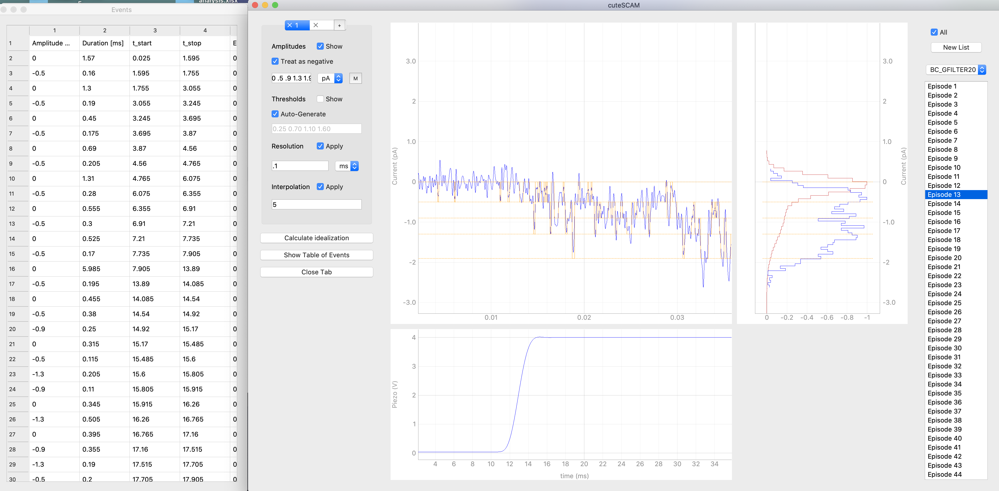

# ASCAM - Advanced Single Channel Analysis for Mac and more

ASCAM can be used to browse, organize and analyze episodic recordings of single ion channel currents.

## Installation
A straightforward installation can be achieved by first installing Anaconda or miniconda. At the time of writing, a working version for Mac is https://repo.anaconda.com/archive/Anaconda3-5.3.0-MacOSX-x86_64.pkg

After successful installation of Anaconda, if you have Git installed, you can clone the ASCAM directory from Github onto your machine with the following command in the Terminal:
`git clone https://github.com/AGPlested/ASCAM`

We recommend to use a clean environment. This can be achieved by installing miniconda and creating an environment called e.g. ASCAM. Note, with Big Sur, some adjustments are needed.
`conda create --name ASCAM python=3.10 && conda activate ASCAM`

By default conda does not install its own version of `pip`. (You can check which version is being used with `pip --version`.)
If it is not the correct one install it in your conda environment using:
`conda install pip`

Then navigate to the folder you downloaded from this page (`ASCAM-master`) and issue:
`pip install -e .`
Note: it might be necessary to install `numpy` separately before installing ASCAM (in this case, try `conda install numpy`).

Note2: On Windows, at time of writing, you need Microsoft C++ build tools 14.0 
https://visualstudio.microsoft.com/visual-cpp-build-tools/ and TICK THE BOX!

This installation makes a shell script that lets you launch ASCAM with the command:
`ascam`

For launch options:
`ascam --help`

### Further installation notes
If you also issue `conda install python.app` in your new environment then you can have a well-behaved Mac GUI with the following command from the parent directory of ASCAM:
`pythonw /ASCAM/src/ascam.py`

20-03-01: Note, with the migration to Qt, some problems may be encountered on the Mac if you already have installations of Qt4+. A fresh environment (e.g. can help.
21-05-25: Update to Big Sur - Pyqtgraph and PyQt need Python 3.8, PySide2 5.15 and the command export QT_MAC_WANTS_LAYER=1 must be issued in the Terminal.

Note: Tables in axograph and matlab have named columns ASCAM uses these names to determine what data is dealing with. Therefore the column containing the recorded current should contain either "current", "trace" or "Ipatch", the name of the column holding the recorded piezo voltage should contain the string "piezo" and the name of the command voltage column should contain "command".

There is an example raw data file of an AMPA receptor single channel patch in the ASCAM/data folder. This recording was sampled at 40 kHz.

You can remove the baseline, filter, and idealise data, or find the time of the first actvation. You can also page through episodes and mark them for later analysis or to be excluded from analysis.

