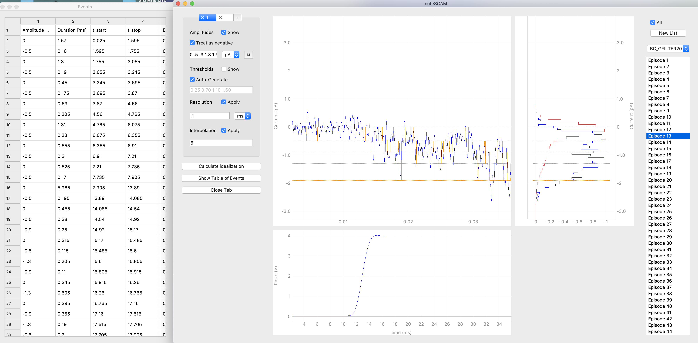

# ASCAM - Advanced Single Channel Analysis for Mac and more

ASCAM can be used to browse, organize and analyze episodic recordings of single ion channel currents.

## Changes Sept 2026
PySide2 no longer works in Tahoe. So the code was minimally modified to run under PySide6 (QAction has moved to QTGui)
PyQtGraph 0.14 is now used, needed some cleanup.
Axographio needs delicate treatment (see below) and latest Clang (in XCode 27) is still a bit fragile at the time of GoldenGate release.
All other packages were allowed to upgrade to arbitrarily modern versions

## Installation
This version works for macOS Sequoia and Tahoe. Might work for Big Sur as well. Use another branch for older machines. Installation on Linux/Windows is not tested. 

A straightforward installation can be achieved by first installing miniconda.

We recommend to use a clean environment. This can be achieved by installing miniconda and creating an environment called e.g. ASCAM. 

You can choose either Python 3.10 (the simplest) or Python 3.14 (the latest):

For Python 3.10 use the following command:
`conda create --name ASCAM python=3.10 && conda activate ASCAM`

Now comes the tricky part. We need to build the axographio package for loading and saving data. 
For this, you need a full version of the Apple XCode suite. The Command Line Tools are (at the moment) not enough. 

Download XCode from the AppStore (you will need to use an AppleID, can be very frustrating). 

You also need Numpy and Cython to build axographio

`pip install numpy`
`pip install cython`

Then you should be able to build axograph with the following command: 
`pip install axographio --no-build-isolation`

Then navigate to the folder you downloaded from this page (`ASCAM-master`) and issue:
`pip install -e .`

This installation makes a shell script that lets you launch ASCAM with the command:
`ascam`

For launch options:
`ascam --help`

If you want to use Python 3.14, you will need to downgrade setuptools before building axographio with the following statement:
`pip install "setuptools<=80.10.2"`

### Further installation notes
If you also issue `conda install python.app` in your new environment then you can have a well-behaved Mac GUI with the following command from the parent directory of ASCAM:
`pythonw /ASCAM/src/ascam.py`

## Running ASCAM
Note: Tables in axograph and matlab have named columns ASCAM uses these names to determine what data is dealing with. Therefore the column containing the recorded current should contain either "current", "trace" or "Ipatch", the name of the column holding the recorded piezo voltage should contain the string "piezo" and the name of the command voltage column should contain "command".

There is an example raw data file of an AMPA receptor single channel patch in the ASCAM/data folder. This recording was sampled at 40 kHz.

You can remove the baseline, filter, and idealise data, or find the time of the first actvation. You can also page through episodes and mark them for later analysis or to be excluded from analysis.

## Quick guide to ASCAM

* Load file by `File > Open file` from the menu bar and selecting the recording using the file browser. `.mat` and `.axgx` or `.axgd` files should open without a problem.
* Baseline correction: `Processing > Baseline correction` from the menu bar
    * You can choose between `methods` `Polynomial` or `Offset` to fit the baseline to a polynomial with a chosen degree or subtract a constant, respectively.
    * The `selection` allows you to put in where the baseline is. This can be `intervals` that you type in or determined by piezo trace automatically.
        * If you choose `piezo` and `active` is unchecked, the baseline is set to the time when the piezo voltage deviates from 0 by more than `deviation` percent.
        * If you choose `piezo` and `active` is checked, the baseline is set to the time when the piezo voltage is different from maximum piezo voltage by more than `deviation` percent.
        * If you choose `intervals` you can put in the start and end times of baseline interval. This needs to be formatted like a python list such as `[0, 15]` or multiple lists like `[0, 15],[90, 100]` if you want to use multiple intervals.
* Filter: `Processing > Filter` and choose between Gauss filter and Chung-Kennedy filter (Chung and Kennedy 1991). In both cases you need to alter needed parameters (corner frequency for Gauss and weights etc. for CK)
* Idealization: `Analysis > Idealize` for finding an idealization using threshold crossing method.
    * You need to put in the `amplitudes` separated by spaces and without any brackets, such as `0 0.7 1.2 1.8 2.2` (pA) for the sample data. You can also drag the drawn lines for the amplitude to adjust them.
    * Thresholds can be put in manually in `thresholds` or auto generated and set to the midpoint between each two amplitudes.
    * If you want to apply a `resolution` to remove shorter events, you can put in a resolution
    * You can also `interpolate` the signal with a cubic spline with an interpolation factor you choose. 
    * After clicking `Calculate idealization` you can show or export event table, or export the idealization. 
* First Activation Threshold: `Analysis > First Activation`. You can type the first activation threshold or make it *draggable* to adjust the line drawn on the trace and click `Set threshold`.
    * You can alternatively go through the episodes to mark the point of first activation manually.
    * If you have idealized the data, you can extract the first activation events using `First events table`. This gives a summary of first opening (or closure) for each level, that happens after the piezo signal and first activation time. The resulting table shows:
        * to which level was the first opening
        * For each level "Si" (i = 0,1,2,3.. where 0 usually corresponds to the shut state) 
            * the start time of the first event at the level
            * the duration of the first event at each level
* Lists: You can make multiple lists of selected episodes. 
    * To do this you need to define a `New List` which prompts you to define a `Key` (a single keystroke) and a `Name` you want to call your list. 
    * You can populate your list of episodes by going through the episodes in the list on the right panel and pressing the selected `Key`. An episode can belong to multiple lists.
    * If you want, you can export the data in order to save your selections. The export dialog gives you the option to select which lists of episodes should be exported.
